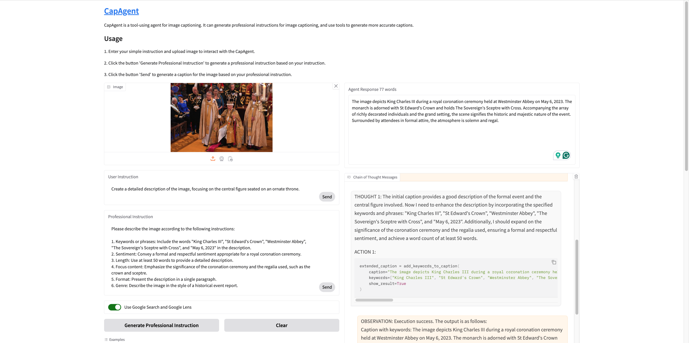

# CapAgent

This is the repo for CapAgent, an agent system with a variety of tools specifically designed to control the image captioning process. As shown in the following figure, like a general agent, CapAgent’s workflow includes three main steps: planning, tool usage, and observation. When the user inputs an image and a caption query, the CapAgent will generate a series of thoughts and corresponding actions to tackle the user request. The technical report for CapAgent will be released soon.

<div align="center">

</div>

## Prepare environment


### Set API Key
```bash
export SERP_API_KEY=<your-serp-api-key> # for search image on web
export OPENAI_API_KEY=<your-openai-api-key> # for using gpt-4o
```

### Install dependencies

```bash
conda create -n capagent python=3.10
conda activate capagent
pip install -r requirements.txt
```

### Install expert models
We use seperated conda environment to install the expert models and deploy the gradioserver.
```bash
mkdir expert_models
cd expert_models

# install GroundingDINO
git clone https://github.com/IDEA-Research/GroundingDINO.git
cd GroundingDINO
conda create -n groundingdino python=3.10
conda activate groundingdino
pip install -e .
cd ../expert_models/client
python detection.py

# install Depth-Anything-V2
git clone https://github.com/DepthAnything/Depth-Anything-V2.git
cd Depth-Anything-V2
conda create -n depthanything python=3.10
conda activate depthanything
pip install -e .
python app.py


# let the gradio server running and test the gradio client
```bash
conda activate capagent
cd expert_models/client
python test_client.py
```

### Generate CoT examples embedding
```bash
bash init_rag_database.sh
```

### Launch server
To let local image online for allowing api, e.g., google search, using url access the image.
```bash
python launch_image_server.py
```

## Run CapAgent
Run on a single image
```bash
python run.py
```

Run on gradio demo
```bash
python gradio_demo.py
``` 
<div align="center">

</div>

## Video Demo

Comming soon ...


# Acknowledgement

We would like to thank the authors of following awesome works:
- [GroundingDINO](https://github.com/IDEA-Research/GroundingDINO)
- [Depth-Anything-V2](https://depth-anything-v2.github.io/)
- [VisualSketchPad](https://visualsketchpad.github.io/)

## Contact
Contact me if you have any questions. Email: wangxr@bupt.edu.cn
