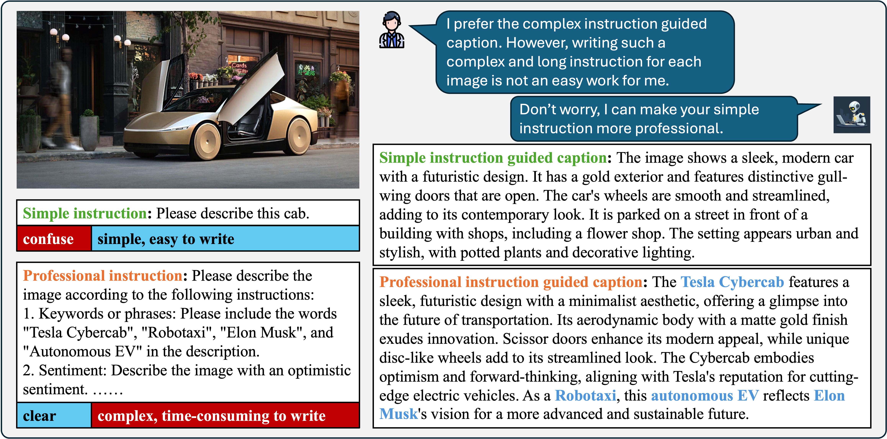
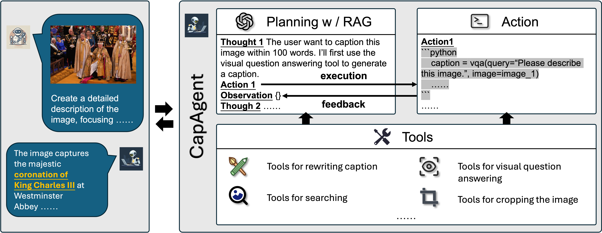

# CapAgent 

## Introduction

This is the repo for CapAgent, an agent system with a variety of tools specifically designed to control the image captioning process. 
Users often give simple instructions like 'please describe the image,' but they expect detailed, meaningful outputs. The challenges lie in transforming these vague inputs into professional instructions and generating descriptions that align precisely with user needs. CapAgent addresses this by refining user inputs automatically and leveraging tools to ensure captions meet expectations effectively. The technical report for CapAgent is [here](https://arxiv.org/abs/2412.11025). We'll continue to update this repo and add more tools.
<div align="center">

</div>

## Methodology
As shown in the following figure, like a general agent, CapAgent’s workflow includes three main steps: planning, tool usage, and observation. When the user inputs an image and a caption query, the CapAgent will generate a series of thoughts and corresponding actions to tackle the user request. 
<div align="center">

</div>

## Prepare environment


### Set API Key
```bash
export SERP_API_KEY=<your-serp-api-key> # for search image on web
export OPENAI_API_KEY=<your-openai-api-key> # for using gpt-4o
```

### Install dependencies

```bash
conda create -n capagent python=3.10
conda activate capagent
pip install -r requirements.txt
```

### Install expert models
We use seperated conda environment to install the expert models and deploy the gradioserver.
```bash
mkdir expert_models
cd expert_models

# install GroundingDINO
git clone https://github.com/IDEA-Research/GroundingDINO.git
cd GroundingDINO
conda create -n groundingdino python=3.10
conda activate groundingdino
pip install -e .
cd ../expert_models/client
python detection.py

# install Depth-Anything-V2
git clone https://github.com/DepthAnything/Depth-Anything-V2.git
cd Depth-Anything-V2
conda create -n depthanything python=3.10
conda activate depthanything
pip install -e .
python app.py


# let the gradio server running and test the gradio client
```bash
conda activate capagent
cd expert_models/client
python test_client.py
```

### Generate CoT examples embedding
```bash
bash init_rag_database.sh
```

### Launch server
To let local image online for allowing api, e.g., google search, using url access the image.
```bash
python launch_image_server.py
```
After launching the image server, you need to do intranet penetration to let the api can access the image.

## Run CapAgent
### Inference on a single image
```bash
python run.py
```

### Gradio Demo
```bash
python gradio_demo.py
``` 

**Generate a professional instruction**

You can input a simple instruction and generate a professional instruction for image captioning. 

**Use Google Search and Google Lens**

If you want to use the search function, please turn on the "Use Google Search and Google Lens" toggle. This can help you generate a more accurate instruction for image captioning. Which allow the image caption contain more accurate information.

<div align="center">

</div>

## Video Demo

[](https://www.youtube.com/watch?v=YU1_dNeZr6Q)


# Acknowledgement

We would like to thank the authors of following awesome works:
- [GroundingDINO](https://github.com/IDEA-Research/GroundingDINO)
- [Depth-Anything-V2](https://depth-anything-v2.github.io/)
- [VisualSketchPad](https://visualsketchpad.github.io/)

## Contact
Contact me if you have any questions. Email: wangxr@bupt.edu.cn

## Citation
If you find this work helpful, please consider giving it a star and citing our technical report: 
```
@misc{wang2024simpleprofessionalcombinatorialcontrollable,
      title={From Simple to Professional: A Combinatorial Controllable Image Captioning Agent}, 
      author={Xinran Wang and Muxi Diao and Baoteng Li and Haiwen Zhang and Kongming Liang and Zhanyu Ma},
      year={2024},
      eprint={2412.11025},
      archivePrefix={arXiv},
      primaryClass={cs.CV},
      url={https://arxiv.org/abs/2412.11025}, 
}
```
